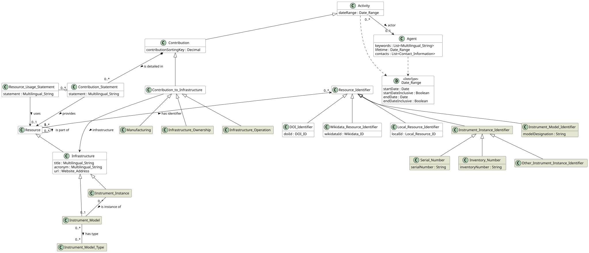
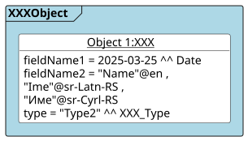

# CERIF Instruments Module
This module contains classes and properties for modeling scientific instruments
in line with the *PIDINST v.1.0* specification (DOI [10.15497/RDA00070](https://doi.org/10.15497/RDA00070)).
The mapping is described in the *[Mapping PIDINST to Refactored CERIF](https://docs.google.com/spreadsheets/d/1w67LH7OcDkDRgjHOj2PCJk0LG3Uj4YZyn8SpLjAttVo/edit?gid=0#gid=0)* shared spreadsheet.
The development of this module was done in the framework of the [INST-DSpace project](https://eurocris.org/projects/inst-dspace-project/) 
led by [euroCRIS](https://eurocris.org/) with funding from the [Vietsch Foundation](https://www.vietsch-foundation.org/).

## Status
(2026-09-28) Work in progress.

## Overview
Instruments – or more specifically [Instrument Instances](./entities/Instrument_Instance.md) – are [Infrastructure](https://github.com/EuroCRIS/CERIF-Core/blob/main/entities/Infrastructure.md).
Instrument instances link information about their [models](./entities/Instrument_Model.md): several instrument instances can share a single model information record.

## Listings

### Entities
The Instruments Module consists of the following entities:
* [Resource](https://github.com/EuroCRIS/CERIF-Core/blob/main/entities/Resource.md) (imported from [the CERIF Core](https://github.com/EuroCRIS/CERIF-Core))
  * [Infrastructure](https://github.com/EuroCRIS/CERIF-Core/blob/main/entities/Infrastructure.md) (imported from [the CERIF Core](https://github.com/EuroCRIS/CERIF-Core))
    * [Instrument Instance](./entities/Instrument_Instance.md) 
    * [Instrument Model](./entities/Instrument_Model.md)

### Data Types
* [XXX data type](./datatypes/XXX.md)
* [YYY data type](./datatypes/YYY.md)

## Illustrative Diagrams

## Usage note
This module cannot be used without the core.
The module includes the following examples:
* [XXX example](./examples/README.md#xxx-example)
* ...

## Development

This module relies on the [CERIF-Core](https://github.com/EuroCRIS/CERIF-Core): we include some shared [entities](https://github.com/EuroCRIS/CERIF-Core/tree/main/entities) and [datatypes](https://github.com/EuroCRIS/CERIF-Core/tree/main/datatypes) from it and we also re-use the [building environment](https://github.com/EuroCRIS/CERIF-Core/tree/main/tools) for the diagrams. This module is developed in line with the [guidelines](https://github.com/EuroCRIS/CERIF-Core/tree/main/guidelines).
