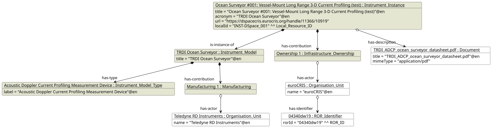

# Examples of usage for CERIF Instruments Module

The module includes the following examples:
* [Ocean Surveyor](#ocean-surveyor-example)

## Ocean Surveyor Example

### Description
The example provides representation of the following equipment record (retrieved from the euroCRIS DSpace-CRIS demonstration server) in CERIF format by using the [Instrument Instance](../entities/Instrument_Instance.md) and [Instrument Model](../entities/Instrument_Model.md) entities and associate entities:

````
Ocean Surveyor #001: Vessel-Mount Long Range 3-D Current Profiling (test)
Owner organisation: euroCRIS
Responsible person: Pablo de Castro
Internal ID: INST-DSpace_001
URL: https://dspacecris.eurocris.org/handle/11366/10919
Manufacturer: Teledyne RD Instruments
https://dspacecris.eurocris.org/entities/equipment/b306bf08-a96c-4933-9ee9-1e84319aaf3b
````

### Illustrative diagram



### Serialization

[Ocean Surveyor Example serialization](01_Ocean_Surveyor/example01.ttl)

### Data of the record not covered by the model

- The equipment description is not mapped: neither Resource nor Infrastructure in CERIF Core has a `description` attribute (see [TODO.md](../TODO.md)).
- The responsible person is an open question of the PIDINST mapping (see [TODO.md](../TODO.md)).
- The date created, the access level, and the file checksum have no counterparts in the model.
- The record has no PID (DOI); the PIDINST mapping uses the [DOI Identifier](https://github.com/EuroCRIS/CERIF-Core/blob/main/entities/DOI_Identifier.md) for the PID, while the internal ID is represented by the Core [Local Resource Identifier](https://github.com/EuroCRIS/CERIF-Core/blob/main/entities/Local_Resource_Identifier.md).
